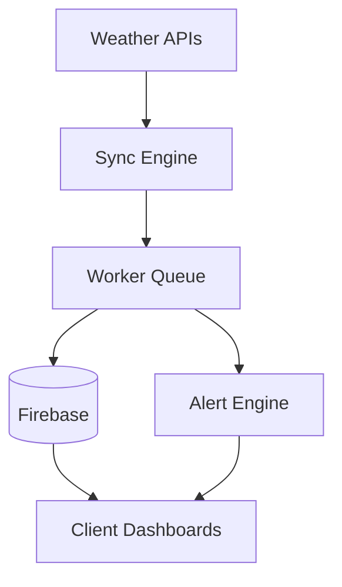

# Architecture

Weatherpulse is built around a robust polling engine and worker queue.

```mermaid
graph TD
    API[Weather APIs] --> Engine[Sync Engine]
    Engine --> Queue[Worker Queue]
    Queue --> Firebase[(Firebase)]
    Queue --> Alerts[Alert Engine]
    Firebase --> Clients[Client Dashboards]
    Alerts --> Clients
```
